# 多人联机地图包（按分类组织）

地图按 **config/maps 下的子文件夹** 自动分类，游戏/插件天然递归扫描子文件夹：

| 文件夹 | 分类 | 说明 |
| --- | --- | --- |
| `config/maps/survival/` | 生存地图 | 自定义生存（PvE 守波）地图放这里 |
| `config/maps/attack/` | 进攻地图 | 自定义进攻地图放这里 |
| `config/maps/pvp/` | PVP地图 | 自定义 PVP 地图放这里 |
| `config/maps/`（根目录） | 自动判定 | 旧地图放根目录仍兼容，按地图规则/核心队伍自动归类（不保证 100% 准确） |
| 游戏内置 | 内置分类 | 游戏自带地图自动在「游戏内置地图」中 |

## 当前内容

### survival/（26 张）

#### 原有（6 张）
- `antarctica-survival.msav` 南极生存（经典，Sharlotte）
- `central-base.msav` 中央基地（经典，Sharlotte）
- `volcanic-grounds.msav` 埃瑞吉火山生存（Erekir / EXTREME）
- `scattered-island.msav` 散落群岛（小图快节奏）
- `hellish-tower-defense.msav` 混合科技塔防（每 100 波 Boss）
- `revenge-of-kyotaer.msav` Kyotaer 系列剧情 PvE

#### 新增 Top 20（2026-08-14，mindustry-tool 验证库按下载量筛选，服务器实测纯生存 `attack=false`）
| 预览 | 文件 | 地图名 | 尺寸 | 星球 | 难度 | 作者 | 下载 | 来源 |
| --- | --- | --- | ---: | --- | --- | --- | ---: | --- |
| 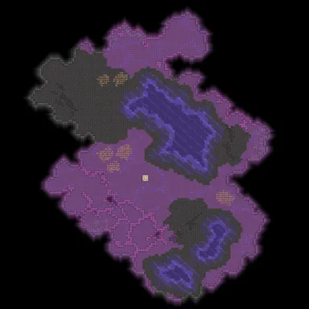 | `Tainted-Lake.msav` | Tainted Lake | 150x150 | serpulo | low | Quad | 228 | [链接](https://mindustry-tool.com/en/maps/019ef86e-1683-7251-a276-97c185d7ad5e) |
| 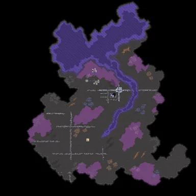 | `Contaminated-Estuary.msav` | Contaminated Estuary | 330x330 | serpulo | eradication | Quad | 210 | [链接](https://mindustry-tool.com/en/maps/019eef6e-a8f2-7757-85fe-c63b4779f422) |
| 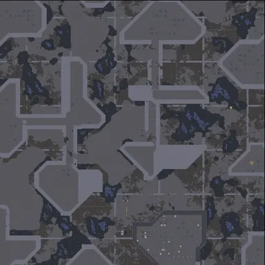 | `Non.msav` | Non | 450x450 | serpulo | medium |  | 205 | [链接](https://mindustry-tool.com/en/maps/019ed705-f393-7413-b332-568d8539e4b5) |
| 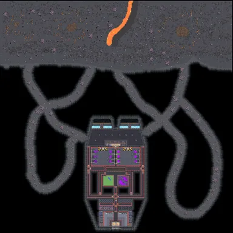 | `Survival-in-cave-base.msav` | Survival in cave base | 300x300 | serpulo |  | Scpplay | 168 | [链接](https://mindustry-tool.com/en/maps/019fa8f8-33ac-734c-89da-cd9f74112af6) |
| 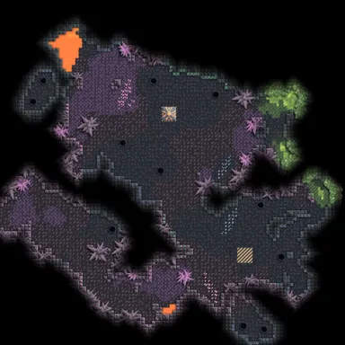 | `Crystallized-N26.msav` | Crystallized N26 | 100x100 |  | high | JustTBG_ | 110 | [链接](https://mindustry-tool.com/en/maps/019e3fe7-6db6-75ba-b057-5226485db55c) |
|  | `Sunken-Pier(TD-Version)v0.2.msav` | Sunken Pier(TD Version)v0.2 | 450x450 | serpulo | medium | Kaviundurs | 107 | [链接](https://mindustry-tool.com/en/maps/019d9d94-5be4-72e8-bc05-aa5f62abeb30) |
| 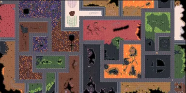 | `City-TD-2-CN.msav` | City TD 2 CN | 500x250 | erekir | medium | DontVin | 94 | [链接](https://mindustry-tool.com/en/maps/019c16b7-8ef6-77d7-bb5d-97e0caf74121) |
| 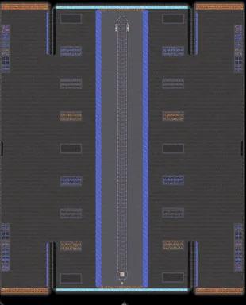 | `Slim-Trail-v0.2.msav` | Slim Trail v0.2 | 250x310 |  | medium | Weslie | 73 | [链接](https://mindustry-tool.com/en/maps/019c16bf-0b96-7550-bfa7-620f7cdb5262) |
| 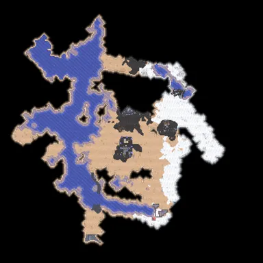 | `1.-River-Assault.msav` | 1. River Assault | 334x334 | serpulo | extreme | darkness | 61 | [链接](https://mindustry-tool.com/en/maps/019c6a2f-9071-70a9-b181-7fd7de7f8f2d) |
| 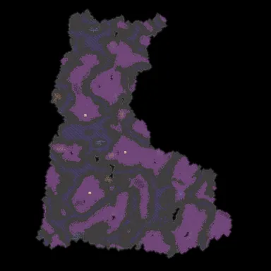 | `Spore-Basin.msav` | Spore Basin | 420x420 | serpulo | high | arbuzik0006 | 57 | [链接](https://mindustry-tool.com/en/maps/019eb878-f59e-744d-a9e8-c7488d3c6533) |
| 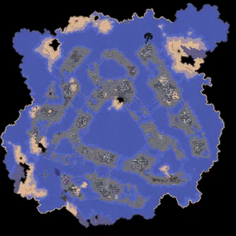 | `Fallen-Vessel.msav` | Fallen Vessel | 597x597 | serpulo | high | Nahan, wpx, Stormride_R | 50 | [链接](https://mindustry-tool.com/en/maps/019c188d-de5b-75ac-a2f7-18323806aa03) |
| 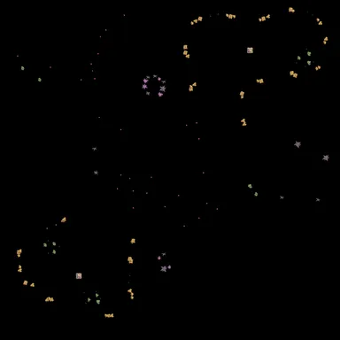 | `volcanic-grounds-v2.msav` | Volcanic Grounds | 300x300 | erekir | extreme | Milololol | 47 | [链接](https://mindustry-tool.com/en/maps/019e14b8-0446-7790-be90-e16745aebde0) |
| 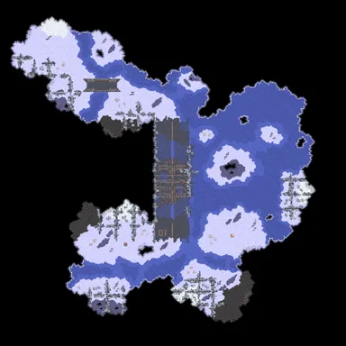 | `Hidden-Pathway.msav` | Hidden Pathway | 550x550 | serpulo | eradication | cyan | 46 | [链接](https://mindustry-tool.com/en/maps/019bee06-ea52-73a8-a8d9-2c0a979d86d6) |
| 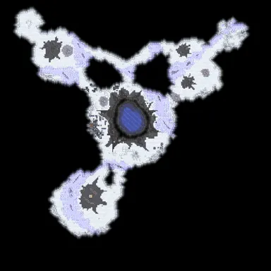 | `The-hell-of-craters.msav` | The hell of craters | 256x256 | serpulo | high | BUFFER BY ngheo_doi | 44 | [链接](https://mindustry-tool.com/en/maps/019bc110-7279-73b1-81e2-e703866f8cf8) |
| 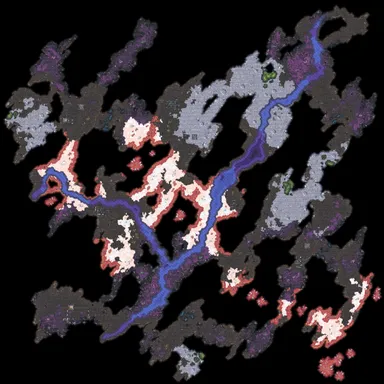 | `Gyrfalke-ru.msav` | Gyrfalke ru | 600x600 | serpulo | medium | hhh i 17 | 43 | [链接](https://mindustry-tool.com/en/maps/019c059c-337f-7738-8eb2-8c316869ab40) |
| 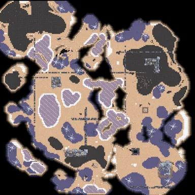 | `salsa.msav` | salsa | 200x200 | serpulo | extreme | ya | 40 | [链接](https://mindustry-tool.com/en/maps/019c059d-47e8-766e-92d8-0908c267d50d) |
| 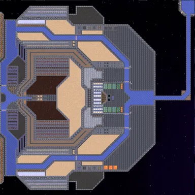 | `Megasurv.msav` | Megasurv | 500x500 | serpulo | high | ? | 40 | [链接](https://mindustry-tool.com/en/maps/019a6df5-cc3f-7fc3-9972-c9c99567bfed) |
| 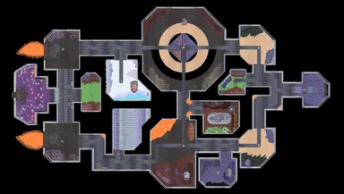 | `THE-SKELD.msav` | THE SKELD | 887x500 | serpulo | medium | Don'tVin | 38 | [链接](https://mindustry-tool.com/en/maps/019a6df5-af04-7940-9855-f7830d187052) |
| 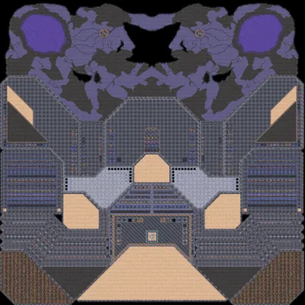 | `Altergrim.msav` | Altergrim | 500x500 | serpulo | medium | Intervection | 27 | [链接](https://mindustry-tool.com/en/maps/019a6df5-be63-7b03-8beb-43055051dcea) |
| 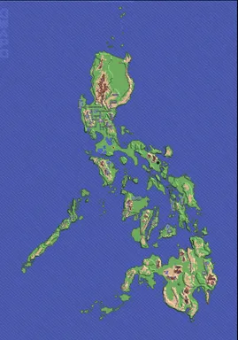 | `Philippines-Seismic-Invasion.msav` | Philippines - Seismic Invasion | 350x500 | serpulo | high | GWAPO | 24 | [链接](https://mindustry-tool.com/en/maps/019a6df5-dc8b-76c2-9c19-4051ccbc4d60) |

### attack/（23 张）

#### 原有（3 张）
- `black-sand-fortress.msav` 黑沙要塞（威胁等级：歼灭级）
- `spore-canyon.msav` 孢菌峡谷（威胁等级：中等）
- `breach-of-siege.msav` 围城突破（Sharlotte）

#### 新增 Top 20（2026-08-14，mindustry-tool 验证库按下载量筛选，服务器实测 `attack=true` 双方核心齐全）
| 预览 | 文件 | 地图名 | 尺寸 | 星球 | 难度 | 作者 | 下载 | 来源 |
| --- | --- | --- | ---: | --- | --- | --- | ---: | --- |
| 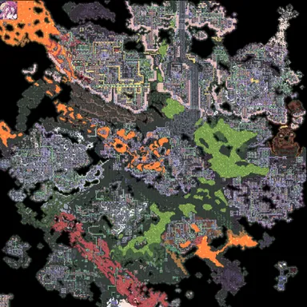 | `Rampant-Field.msav` | Rampant Field | 500x500 | erekir | eradication | idkwhat7name | 633 | [链接](https://mindustry-tool.com/en/maps/019a6dfa-97a0-7253-814d-0d4ef346a031) |
| 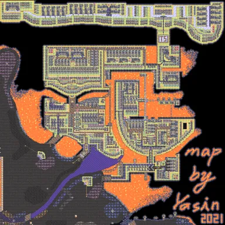 | `Zombie_Source_Experimental_Center.msav` | Zombie_Source_Experimental_Center | 500x500 |  | eradication | Yasin亞辛 | 547 | [链接](https://mindustry-tool.com/en/maps/019ea79b-dbcb-75a5-9b05-73752b85e0cc) |
| 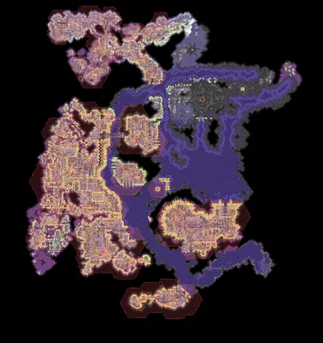 | `Blacksite-Armament-Network.msav` | Blacksite Armament Network | 415x440 | serpulo | eradication | bravotism07 | 450 | [链接](https://mindustry-tool.com/en/maps/019b2b2d-00f2-72de-a07a-2a7eecdb79b0) |
| 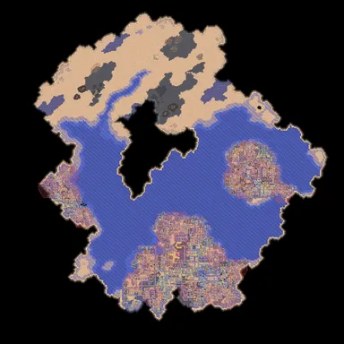 | `Sea-Outpost.msav` | Sea Outpost | 400x400 | serpulo | extreme | Quad | 395 | [链接](https://mindustry-tool.com/en/maps/019ef808-d293-7251-bea3-901863291c8e) |
| 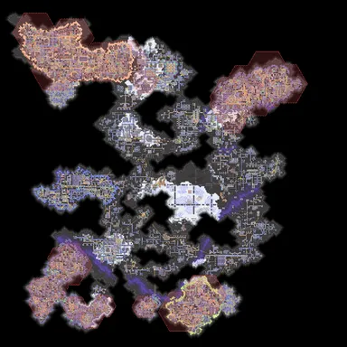 | `Invasion.msav` | Invasion | 350x350 | serpulo | extreme | Quad | 377 | [链接](https://mindustry-tool.com/en/maps/019f1840-c03f-768e-8a27-03248977edae) |
| 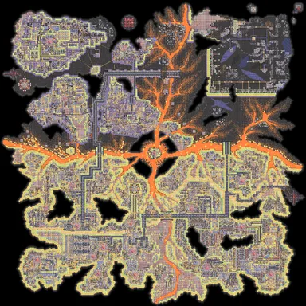 | `Basalt-Citadel.msav` | Basalt Citadel | 440x440 | serpulo | eradication | m0n5t3r & others | 325 | [链接](https://mindustry-tool.com/en/maps/019f7a64-98dd-74fc-ba75-496fb3c8f964) |
| 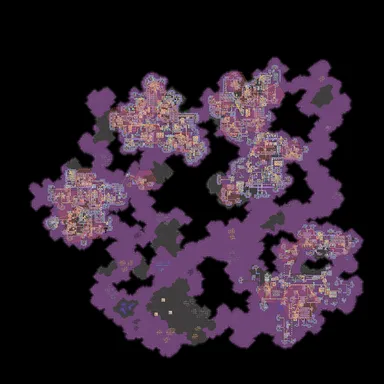 | `Infected-Stronghold.msav` | Infected Stronghold | 440x440 | serpulo | extreme | Quad | 280 | [链接](https://mindustry-tool.com/en/maps/019eee01-624a-706e-9e83-7f414aae1a5d) |
| 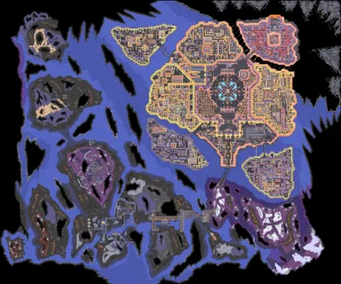 | `Crux-Planetary-Navaltower.msav` | Crux Planetary Navaltower | 600x500 | serpulo | eradication | Stell Drone | 261 | [链接](https://mindustry-tool.com/en/maps/019b7c2e-d68d-70c9-abfd-7510e39fd98b) |
| 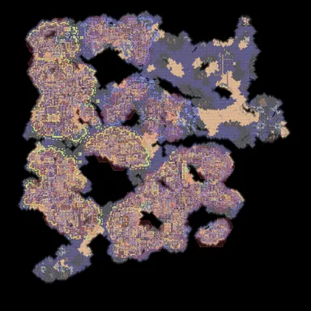 | `Oil-Processing-Facility.msav` | Oil Processing Facility | 400x400 | serpulo | extreme | Quad | 250 | [链接](https://mindustry-tool.com/en/maps/019e1a7d-012b-71e8-8cdb-d02f58eed9a2) |
| 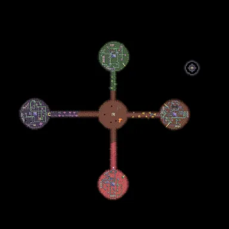 | `hex-evation.msav` | hex evation | 325x325 | erekir | medium | phail | 232 | [链接](https://mindustry-tool.com/en/maps/019edab8-ca5c-716b-87d1-7f25afbe49d9) |
| 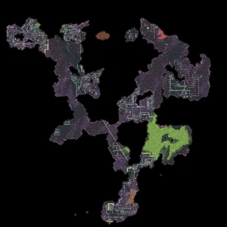 | `Stronghold-but-holder.msav` | Stronghold but holder | 586x586 | erekir | high | Epowerj | 228 | [链接](https://mindustry-tool.com/en/maps/019a6dfa-9262-71d2-b4a4-1fcb9867d367) |
| 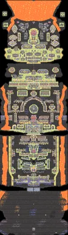 | `The-Dragons-Spine-v1.8.1.msav` | The Dragons Spine v1.8.1 | 219x750 | serpulo | eradication | NovaStar | 227 | [链接](https://mindustry-tool.com/en/maps/019a6dfa-773c-71e2-878e-c172188451d8) |
|  | `Station-Omega-attack-(V7).msav` | Station Omega attack (V7) | 500x500 | serpulo | extreme | g4l4xic | 218 | [链接](https://mindustry-tool.com/en/maps/019b926d-1153-71ca-96cc-aad262a0c780) |
| 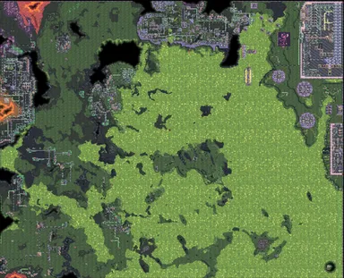 | `Sulphurous-Sea.msav` | Sulphurous Sea | 492x398 | erekir | extreme | Don'tVin | 210 | [链接](https://mindustry-tool.com/en/maps/019a6dfa-8bcf-7532-aee4-1b477393f7ff) |
| 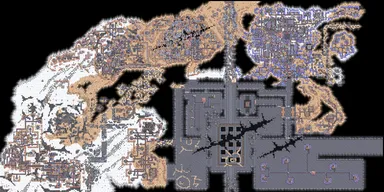 | `dry-desert.msav` | dry desert | 400x200 |  | medium | Red_carrot2655 | 209 | [链接](https://mindustry-tool.com/en/maps/019e5dc1-25de-76c8-a24d-788d336cdb50) |
| 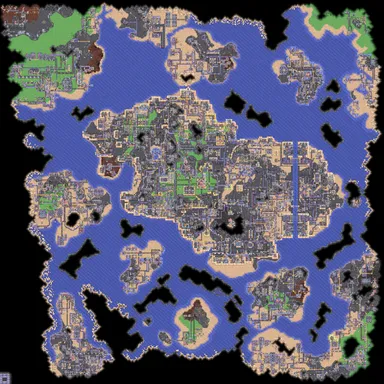 | `seperated-island.msav` | seperated island | 500x500 | serpulo | high | BartelekPL | 189 | [链接](https://mindustry-tool.com/en/maps/019a6dfa-441b-7e13-a3a9-1dd9dba19a8c) |
| 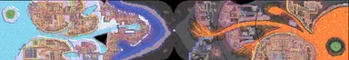 | `Bipolar-Disorder.msav` | 双相情感障碍 Bipolar Disorder | 725x125 | serpulo | eradication | 心碎三明治 | 175 | [链接](https://mindustry-tool.com/en/maps/019f7d09-59bb-742d-a1bb-63625a54edc2) |
| 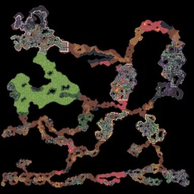 | `Erekir-Final.msav` | Erekir Final | 700x700 | erekir | eradication | Dimoid | 172 | [链接](https://mindustry-tool.com/en/maps/019ec00f-faf1-77d8-9de0-4c9febd7b448) |
| 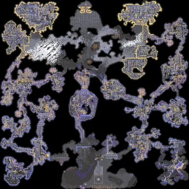 | `Veridian-Vasion-v6.1.msav` | Veridian Vasion v6.1 | 500x500 | serpulo | extreme | coreysj & Nova | 170 | [链接](https://mindustry-tool.com/en/maps/019a6dfa-6cb7-7163-95ba-6d3a820b23be) |
| 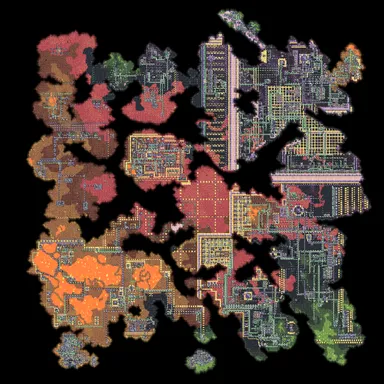 | `Bataman-Fort.msav` | Bataman Fort | 530x530 | erekir | eradication | Nahan | 168 | [链接](https://mindustry-tool.com/en/maps/019a6dfa-2f02-7db3-a09b-473cbc322886) |

### pvp/（3 张）
- `pvp-4-corners-of-death.msav` 死亡四角（四方混战，NYDUS 服务器图）
- `pvp-war-zone-revamped.msav` 战争地带·重制（NYDUS 服务器图）
- `scrap-pvp.msav` 废料混战（Sharlotte）

预览图位于 `docs/previews/`，仅用于本 README 展示，部署时不需要。

## 部署

1. 把整个文件夹（survival/ attack/ pvp/）上传到服务器 `config/maps/` 下。
2. 重启服务器，或运行中输入 `reloadmaps` 重新扫描。
3. 玩家 `/maps`：先选分类（游戏内置/生存/进攻/PVP），再选图；编号可直接用于 `/map <编号>`。

提示：根目录的自动判定对"蓝红双核心"的图可能归入进攻（例如 veins），
这类图建议直接放进 `pvp/` 文件夹，文件夹优先级最高。

## 来源
- mindustry-tool.com（已验证地图库，按下载量挑选）
- Sharlottes/SharMapPackage（GitHub）
- Quezler/mindustry__nydus--map-pool（NYDUS 服务器图池，GitHub）
